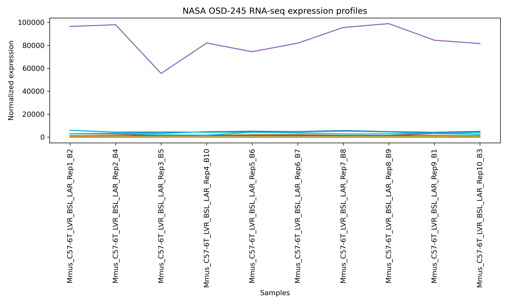
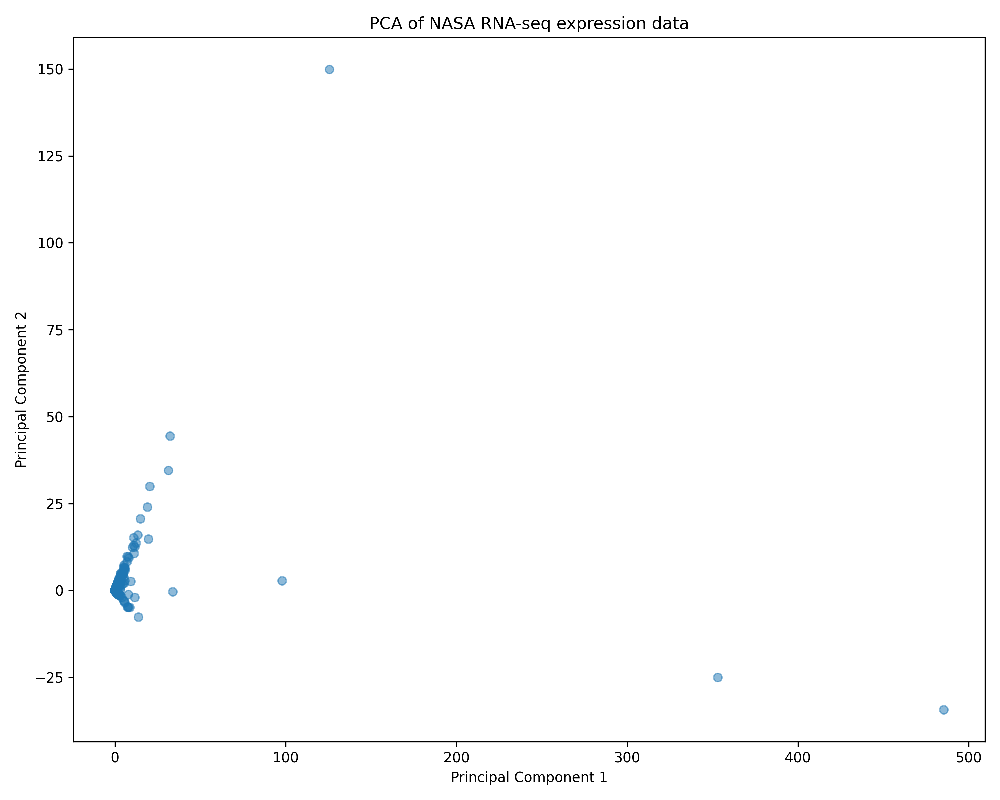
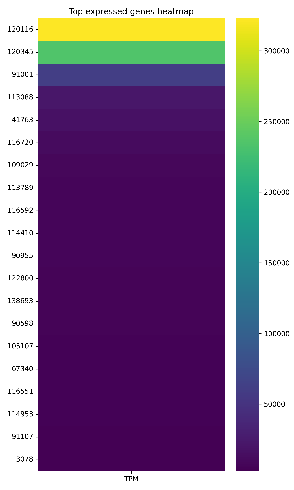
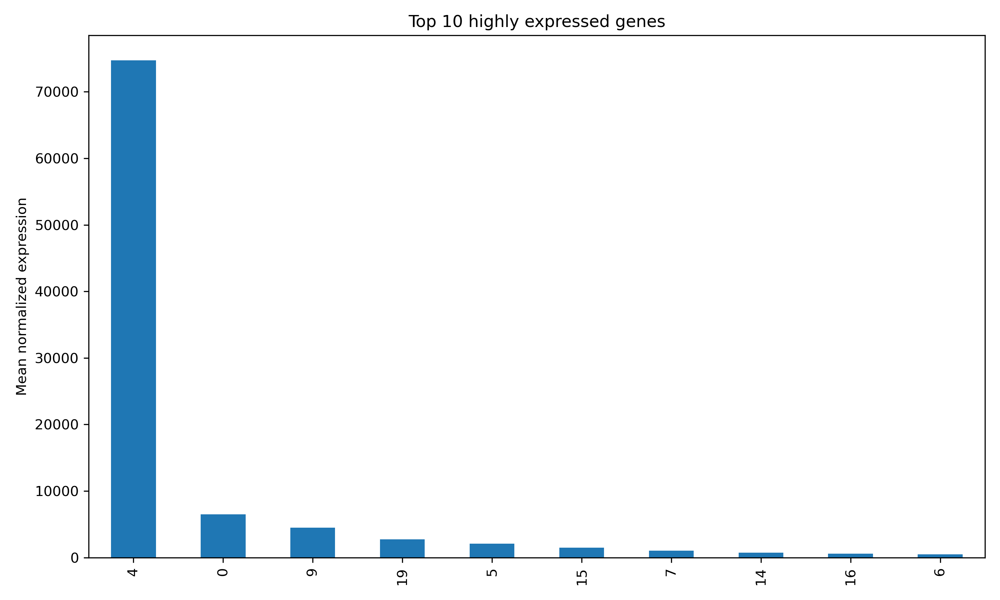
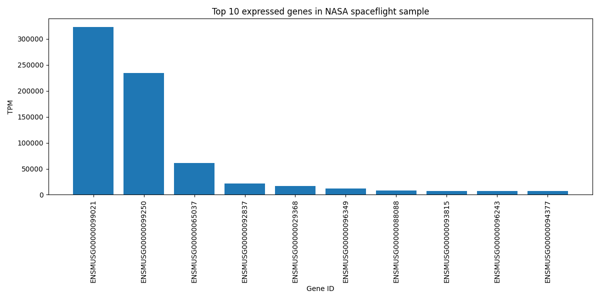

# NASA Spaceflight AI – RNA-seq Transcriptomics Analysis

## Overview

This project analyzes NASA spaceflight RNA-seq transcriptomics datasets using Python, bioinformatics workflows, data visualization, and machine learning techniques.

The analysis focuses on gene expression patterns observed in biological samples exposed to spaceflight conditions.

The project includes:

- RNA-seq preprocessing
- Exploratory transcriptomics analysis
- PCA dimensionality reduction
- Heatmap visualization
- Highly expressed gene detection
- Comparative transcriptomics
- AI/ML clustering methods

---

## Technologies Used

- Python
- Pandas
- NumPy
- Matplotlib
- Seaborn
- Scikit-learn
- Jupyter Notebook

---

## Datasets

NASA GeneLab RNA-seq datasets:

- GLDS-168
- GLDS-245

These datasets contain transcriptomics measurements from mouse biological samples exposed to spaceflight-related conditions.

---

## Project Structure

```text
nasa-spaceflight-ai/
│
├── figures/
│   ├── osd245_expression_profiles.png
│   ├── pca_spaceflight.png
│   ├── top_genes_heatmap.png
│   ├── top10_genes_osd245.png
│   └── top10_spaceflight_genes.png
│
├── nasa_spaceflight_ai.ipynb
├── nasa_comparative_transcriptomics.ipynb
├── quick_analysis.py
├── README.md
```

---

## RNA-seq Analysis Workflow

### 1. Data Loading

RNA-seq transcriptomics datasets were loaded into Pandas DataFrames and preprocessed for downstream analysis.

### 2. Gene Expression Analysis

The project identifies highly expressed genes using normalized transcriptomics counts and TPM values.

### 3. PCA Analysis

Principal Component Analysis (PCA) was applied to reduce dimensionality and visualize transcriptomic variability across samples.

### 4. Heatmap Visualization

Heatmaps were generated to visualize top expressed genes and expression intensity patterns.

### 5. Machine Learning

K-Means clustering was used to identify gene expression clusters and transcriptomic patterns.

---

## Results

### NASA OSD-245 Expression Profiles



---

### PCA of RNA-seq Expression Data



---

### Top Expressed Genes Heatmap



---

### Top Highly Expressed Genes



---

### Top Expressed Genes in NASA Spaceflight Sample



---

## Example Machine Learning Code

```python
from sklearn.cluster import KMeans
from sklearn.preprocessing import StandardScaler

X = df[['TPM', 'FPKM', 'expected_count']]

scaler = StandardScaler()
X_scaled = scaler.fit_transform(X)

kmeans = KMeans(n_clusters=3, random_state=42)

df['cluster'] = kmeans.fit_predict(X_scaled)
```

---

## Future Improvements

- Deep learning models for transcriptomics
- Differential gene expression analysis
- Biological pathway enrichment analysis
- Outlier and anomaly detection
- Multi-omics integration
- Interactive dashboards

---

## Author

Agata Gabara

GitHub Repository:
https://github.com/ag48665/nasa-spaceflight-ai
